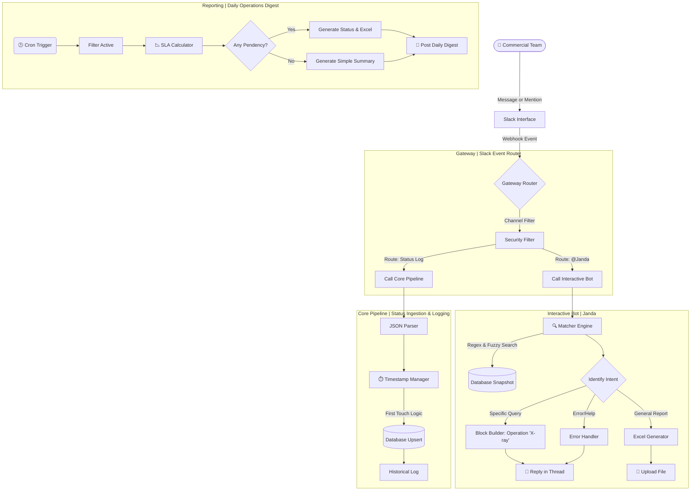

# Janda: Commercial Operations Orchestrator & SLA Engine

> **Note:** This repository contains the architectural logic and orchestration flows of the "Janda" project.

---

## About the Project

**Janda** is a **Deterministic ChatOps** agent developed to orchestrate the information flow of the commercial department of a large-scale Shopping Center (+90k m² GLA).

Unlike assistants based on Generative AI, Janda acts as a rigid **State Machine**. She monitors the lifecycle of contracts, construction works, internal system access, and tenant documentation, ensuring date auditing, precise SLA calculation, and instant data recovery via _Slack_.

The system acts as *Middleware*, connecting unstructured data input (Slack list entries - a corporate communication platform) to a structured database, transforming _Slack_ into a command interface (CLI) for the business team.

---

## Context and Real-World Impact (Production Environment)

The solution was deployed to unify the data flow between the Sales (Field) and Operational (Back-office) teams. Before Janda, tracking was conducted in a fragmented manner; the automation centralized this information, establishing a layer of shared visibility and standardization in the operations lifecycle.

**Key Performance Indicators (KPIs):**
* **Standardization & Routine:** Standardized messages and implementation of schedules for sending updates and reports, decreasing the previous notification average from ~3 to 1 per day;
* **Latency Reduction:** Optimization of **1,260 annual hours** for the commercial team (Strategic Focus), considering studies indicating that the human brain takes around 25 minutes to recover concentration after an interruption (Context Switching);
* **SLA Auditing:** Implementation of event-based deadline traceability, allowing for the identification of bottlenecks in the leasing funnel;
* **User Experience:** Immediate adoption by the team due to the _Slack_ interface (Zero-Learning Curve), eliminating the need for training in new ERPs.

---

## Technical Architecture

The system utilizes a **Microservices via Workflows** architecture, where each _n8n_ workflow has a unique responsibility (Single Responsibility Principle), as follows:

* **00 - Gateway Service:** Acts as the central entry point (Entrypoint). It receives Slack webhooks, performs security filtering, and routes requests to specific services based on user intent or event type;

* **01 - Core Pipeline:** Responsible for processing and persistence. It parses raw data, applies timestamp immutability logic, and manages the database (Upsert), ensuring that each event is recorded with integrity;

* **02 - Daily Reporting:** A scheduled service (schedule node) that checks the database, processes the SLA calculator, and generates the "Daily Summary" and, if necessary, the "Pending Status Report" (Farol) with an Excel file. It autonomously decides which level of detail should be posted to the channel;

* **03 - Interactive Bot:** Manages the conversational interface (UX/UI). Processes the hybrid search (Regex/Fuzzy), builds Slack visual blocks (Block Kit), and handles the generation of Excel files for immediate export.

### Flow Diagram

---

## Data Schema

To ensure total traceability and integrity, Janda utilizes three main datatables with the `slack_item_id` as the central link:

### 1. Snapshot (Current State)
This table presents the consolidated situation of each commercial negotiation, serving as the main reference for consulting the current status of documentation, intranet access, contracts, and construction in real-time.

* **Identifiers:** `slack_item_id` (primary key), `businesskey`.
* **Operation Attributes:** `marca` (brand), `tipo_operacao` (operation type), `suc`, `localizacao` (location) , `executivo` (executive), `observacao` (observation), `quem_editou` (edition by), `data_edicao` (edited date), `data_criacao` (creation date).
* **Monitored Status:** `documentacao` (documentation), `intranetmall`, `status_contrato` (contract status), `status_projeto` (project status).
* **Datas de Vigência:** `inicio_vig`, `inauguracao_contratual`, `inauguracao_prevista`.
* **SLA Engine (Event Timestamps):**
    * **Documentation:** `dt_doc_pendente`, `dt_doc_incompleto`, `dt_doc_recebida`.
    * **Systems:** `dt_intranet_solicitado`, `dt_intranet_enviado_lojista`.
    * **Contract:** `dt_contrato_confeccao`, `dt_contrato_enviado`, `dt_contrato_assinatura`, `dt_contrato_assinado`.
    * **Projects:** `dt_projeto_pendente`, `dt_projeto_em_aprovacao`, `dt_projeto_aprovado`.
* **Standard System Metadata (_n8n_):** `id`, `data_criacao`, `createdAt`, `updatedAt`.

### 2. Daily Log & Historical Log (Events and Transitions)
Both record the data journey and state changes. The `log_diario` (Daily Log) focuses on recent events for quick reports, while the `log_historico` (Historical Log) maintains the complete trail for auditing or future analysis.

* **Identifiers and Context:** `id`, `slack_item_id`, `marca`, `tipo_operacao` (operation type), `data_criacao` (when the item was created in the _Slack list_).
* **Change Auditing:** `campo` (identifies what changed), `de` (previous value), `para` (new value), `quem` (author of modification), `data_hora` (timestamp of change).
* **Performance Metrics:** `dias_na_etapa_anterior` (calculated in real-time to measure Lead Time).
* **Standard System Metadata (_n8n_):** `id`, `createdAt`, `updatedAt`.

---

## Uniqueness Guarantee via slack_item_id

Janda utilizes the `slack_item_id` as the primary key.

### Why this approach?
The commercial sector frequently negotiates different types of operations for the same brand (e.g., offline media and physical store) or has recurring seasonal events (such as parks, fairs, and stands) from the same partner (e.g., "Natura - Mother's Day" and "Natura - Tododia").

To ensure that each negotiation is treated individually and to prevent Slack edits from generating redundant data or resetting the history of a particular operation, the system uses the `slack_item_id` as the primary identification key.

* **Instance Differentiation:** By using the message ID as an anchor, the system allows multiple contracts from the same brand to coexist without data conflict or date overlap;

* **Edit Synchronization:** When an executive edits a message in the _Slack list_, the system identifies the corresponding ID (`slack_item_id`) and performs an Upsert, maintaining the integrity of that specific negotiation instead of creating a new record;

* **Historical Integrity:** The unique ID acts as the link between `snapshot` and `log`, allowing the complete history of a specific negotiation to be reconstructed.

---

## Deep Dive: Business Logic

**1. Timestamp Immutability (First Touch Logic)**

To ensure SLA integrity, the system ignores duplicate events and seals the "First Touch" date. This prevents Slack message re-edits from altering the audit history, ensuring an append-only event log.

**2. Hybrid Matcher Engine**

To handle human typing errors, the bot uses a hybrid search engine that combines:

* **Structured Search:** Identifies _Type - Brand_ patterns (e.g., "Store - Adidas");
* **Global Search:** Scans the entire snapshot for normalized keywords (accent-neutral/case-insensitive);
* **Sanitization:** Removes special characters and stop-words to prevent false negatives.

**3. Threaded Reporting UX**

To avoid visual pollution in the channel (Flood), all complex reports (Daily Updates and Pending Status Report) utilize the _Slack_ Thread reply feature.

* **Parent Message:** Header with Date and Context;
* **Thread 1:** Summary of new operations added to the _Slack list_ and contracts signed the previous day;
* **Thread 2:** Pending Status Report (only if there are delays);
* **Thread 3:** Detailed Excel file of the Pending Status Report.

---

## Tech Stack

**Orchestration:** _n8n_

**Scripting Language:** JavaScript for data manipulation.

**Interface:** _Slack_ & Block Kit Framework.

**Database:** Native _n8n_ _datatables_.

**Data Treatment:** 

> * **RegEx & String Normalization:** For the hybrid search engine and _Slack_ input cleaning;
> * **JSON Object Parsing:** Handling complex payloads and _Slack API_ block structures;;
> * **Date Logic:** AlgorAlgorithms for SLA calculation in calendar days, Timezone handling (UTC to PT-BR), and schedule validation.

---

## Data Persistence

The choice of _n8n Data Tables_ as the initial repository was strategic, prioritizing low write latency and agility in the development cycle (MVP).

* **Interoperability:** The system was designed to be database-independent. Transitioning to a relational database or NoCode tools only requires swapping nodes in the workflows, without the need for business logic refactoring.

* **Data Export:** For immediate analysis and data modeling, **_n8n_ allows the extraction of _datatables_ in _CSV_ format**. Additionally, Janda herself sends, when requested, a general report in _XLSX_ of the current `snapshot` with operations under tracking. This ensures total portability for conversion to **XLSX or direct ingestion into BI tools**, ensuring that the operation history is never locked into a proprietary structure.

---

## Strategic Evolution Roadmap

**Phase 1:** Consolidation and Feedback (Short Term)
Focus on total validation (Commercial SCIB/TD/Corporate Commercial) of notification flows and commercial team onboarding. The goal is to ensure that summaries at pre-defined times are the consultation source for management and a daily priority guide for the team.

**Phase 2:** Scalability (Mid-Long Term)
Direct integration of structured n8n data with Business Intelligence (BI) tools for executive dashboards.

---

## Conclusion

The Janda project goes beyond an isolated automation; it is the transition of the Commercial department to Data-Driven management. Technology assumes the rigid operational role so that people can focus on what is irreplaceable: strategy, negotiation, and relationships.
