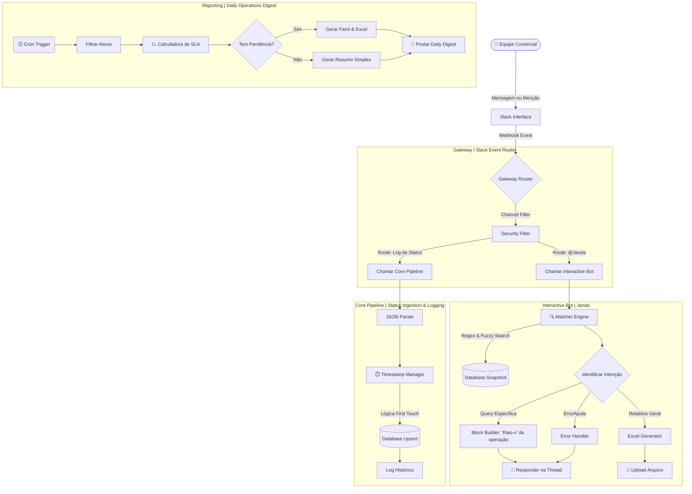

# Janda: Commercial Operations Orchestrator & SLA Engine

> **Nota:** Este repositório contém a lógica arquitetural e os fluxos de orquestração do projeto "Janda".

[🇺🇸 You can read this in English](./README.en.md)

---

## Sobre o Projeto

A **Janda** é uma agente de **ChatOps Determinístico** desenvolvida para orquestrar o fluxo de informações do setor comercial de um Shopping Center de grande porte (+90k m² ABL).

Diferente de assistentes baseados em IA Generativa, a Janda atua como uma **Máquina de Estados (State Machine)** rígida. Ela monitora o ciclo de vida de contratos, obras, acesso a sistema interno e documentação de locatários, garantindo auditoria de datas, cálculo preciso de SLAs e recuperação instantânea de dados via _Slack_.

O sistema atua como *Middleware*, conectando a entrada de dados não estruturada (preenchimento de lista no _Slack_ - plataforma corporativa de comunicação) a um banco de dados estruturado, transformando o _Slack_ em uma interface de comando (CLI) para a equipe de negócios.

---

## Contexto e Impacto Real (Production Environment)

A solução foi implantada para unificar o fluxo de dados entre as equipes de Vendas (Campo) e Operacional (Back-office). Antes da Janda, o acompanhamento era realizado de forma fragmentada; a automação centralizou essas informações, estabelecendo uma camada de visibilidade compartilhada e padronização no ciclo de vida das operações.

**Key Performance Indicators (KPIs):**
* **Padronização & Rotina:** Mensagens padronizadas e implementação de horários para enviar os updates e relatórios, diminuindo a média de notificações anterior de ~3 para 1 por dia;
* **Redução de Latência:** Otimização de **1.260 horas anuais** da equipe comercial (Foco Estratégico), considerando estudos que indicam que o cérebro humano leva em torno de 25 min. pra recuperar a concentração após uma interrupção (Context Switching);
* **Auditoria de SLA:** Implementação de rastreabilidade de prazos baseada em eventos (ex: abertura de protocolo de confecção de contrato), permitindo identificar gargalos no funil de locação;
* **User Experience:** Adoção imediata pela equipe devido à interface via _Slack_ (Zero-Learning Curve), eliminando a necessidade de treinamento em novos ERPs.

---

## Arquitetura Técnica

O sistema utiliza uma arquitetura de **Microsserviços via Workflows**, onde cada fluxo no _n8n_ tem uma responsabilidade única (Single Responsibility Principle), sendo elas:

* **00 - Gateway Service:** Atua como o ponto central de entrada (Entrypoint). Ele recebe os webhooks do Slack, realiza a filtragem de segurança e roteia as requisições para os serviços específicos com base na intenção do usuário ou no tipo de evento;

* **01 - Core Pipeline:** Responsável pelo processamento e persistência. Ele faz o parsing dos dados brutos, aplica a lógica de imutabilidade de timestamps e gerencia os banco de dados (Upsert), garantindo que cada evento seja registrado com integridade;

* **02 - Daily Reporting:** Um serviço agendado (schedule node) que verifica a base de dados, processa a calculadora de SLA e gera o "Resumo diário" e, caso necessário, o "Farol de Pendências" com arquivo excel. Ele decide, de forma autônoma, qual nível de detalhamento deve ser postado no canal;

* **03 - Interactive Bot:** Gerencia a interface conversacional (UX/UI). Processa a busca híbrida (Regex/Fuzzy), constrói os blocos visuais do Slack (Block Kit) e lida com a geração de arquivos Excel para exportação imediata.

### Diagrama de Fluxo

---

## Estrutura de Dados (Data Schema)

Para garantir rastreabilidade total e integridade, a Janda utiliza três datatables principais com o `slack_item_id` como elo central:

### 1. Snapshot (Estado Atual)
Esta tabela apresenta a situação consolidada de cada negociação comercial, servindo como a referência principal para consultar o status atual de documentações, acesso ao intranet, contratos e obras em tempo real.

* **Identificadores:** `slack_item_id` (chave primária), `businesskey`.
* **Atributos de Operação:** `marca`, `tipo_operacao`, `suc`, `localizacao`, `executivo`, `observacao`, `quem_editou`, `data_edicao`, `data_criacao`.
* **Status Monitorados:** `documentacao`, `intranetmall`, `status_contrato`, `status_projeto`.
* **Datas de Vigência:** `inicio_vig`, `inauguracao_contratual`, `inauguracao_prevista`.
* **SLA Engine (Timestamps de Eventos):**
    * **Documentação:** `dt_doc_pendente`, `dt_doc_incompleto`, `dt_doc_recebida`.
    * **Sistema:** `dt_intranet_solicitado`, `dt_intranet_enviado_lojista`.
    * **Contrato:** `dt_contrato_confeccao`, `dt_contrato_enviado`, `dt_contrato_assinatura`, `dt_contrato_assinado`.
    * **Projeto:** `dt_projeto_pendente`, `dt_projeto_em_aprovacao`, `dt_projeto_aprovado`.
* **Metadados Padrões de Sistema (_n8n_):** `id`, `data_criacao`, `createdAt`, `updatedAt`.

### 2. Log Diário & Log Histórico (Eventos e Transições)
Ambos registram a jornada do dado e as mudanças de estado. O `log_diario` foca em eventos recentes para relatórios rápidos, enquanto o `log_histórico` mantém a trilha completa para auditoria ou análises futuras.

* **Identificadores e Contexto:** `slack_item_id`, `marca`, `tipo_operacao`, `data_criacao` (quando o item foi criado na _lista do Slack_).
* **Auditoria de Alteração:** `campo` (identifica qual dado mudou), `de` (valor anterior), `para` (novo valor), `quem` (autor da modificação), `data_hora` (quando a mudança foi feita).
* **Métricas de Performance:** `dias_na_etapa_anterior` (calculado em tempo real para medir o Lead Time).
* **Metadados Padrões de Sistema (_n8n_):** `id`, `createdAt`, `updatedAt`.

---

## Garantia de Unicidade via slack_item_id

A Janda utiliza o `slack_item_id` como chave primária. 

### Por que essa abordagem?
O setor comercial frequentemente negocia diferentes tipos de operação para uma mesma marca (ex: mídia offline e loja física) ou possui recorrência de eventos sazonais (como parques, feiras e stands) de um mesmo parceiro (ex: Natura - Dia das Mães, Natura - Tododia).

Para garantir que cada negociação seja tratada de forma individual e evitar que edições no Slack gerem dados redundantes ou resetem o histórico de determinada operação, o sistema utiliza o `slack_item_id` como chave de identificação principal.

* **Diferenciação por Instância:** Ao usar o ID da mensagem como âncora, o sistema permite que coexistam múltiplos contratos de uma mesma marca sem conflito de dados ou sobreposição de datas;

* **Sincronização de Edições:** Quando um executivo edita uma mensagem na lista do Slack, o sistema identifica o ID correspondente e realiza um Upsert, mantendo a integridade daquela negociação específica em vez de criar um novo registro;

* **Integridade de Histórico:** O ID único atua como o elo entre o `snapshot` e `log`, permitindo que o histórico completo de uma negociação específica seja reconstruído.

---

## Deep Dive: Lógica de Negócio

**1. Timestamp Immutability (First Touch Logic)**

Para garantir a integridade dos SLAs, o sistema ignora eventos duplicados e sela a data do "Primeiro Toque". Isso impede que reedições de mensagens no _Slack_ alterem o histórico de auditoria, garantindo um log de eventos append-only.

**2. Hybrid Matcher Engine**

Para lidar com erros de digitação humanos, o bot utiliza um motor de busca híbrido que combina:

* **Busca Estruturada:** Identifica padrões Tipo - Marca (ex: "Loja - Adidas");
* **Busca Global:** Varre todo o snapshot por palavras-chave normalizadas (sem acentos/case-insensitive);
* **Sanitização:** Remove caracteres especiais e stop-words para evitar falso-negativos.

**3. Threaded Reporting UX**

Para evitar poluição visual no canal (Flood), todos os relatórios complexos (Resumo Diário e Farol de Pendências) utilizam o recurso de responder em Threads do _Slack_.

* **Mensagem Pai:** Cabeçalho com Data e Contexto;
* **Thread 1:** Resumo de novas operações adicionadas na lista do _Slack_ e contratos assinados no dia anterior;
* **Thread 2:** Farol de Pendências (apenas se houver atrasos);
* **Thread 3:** Arquivo Excel detalhado do Farol de Pendências.

---

## Stack Tecnológico

**Orquestração:** _n8n_

**Linguagem de Script:** JavaScript para manipulação de dados complexos.

**Interface:** _Slack_ & Block Kit Framework.

**Banco de Dados:** _datatables_ nativos do _n8n_.

**Tratamento de Dados:** 

> * **RegEx & String Normalization:** Para o motor de busca híbrido e limpeza de inputs do Slack;
> * **JSON Object Parsing:** Tratamento de payloads complexos e estruturas de blocos da API do Slack;
> * **Date Logic:** Algoritmos para cálculo de SLA em dias corridos, manipulação de Timezones (UTC para PT-BR) e validação de cronogramas.

---

## Governança de IA

Este projeto utilizou práticas de AI-Assisted Development para reduzir o tempo de codificação e aumentar a cobertura de testes lógicos.

**Ferramenta:** Gemini 3.0 Pro.

**Protocolo de Segurança:** Nenhuma regra de negócio sensível, credencial ou dado pessoal (PII) foi submetido ao modelo. A IA atuou estritamente na geração de snippets de sintaxe JavaScript e formatação de JSON, garantindo a conformidade com as políticas de dados da empresa.

---

## Data Persistence

A escolha dos _n8n Data Tables_ como repositório inicial foi estratégica, priorizando a baixa latência de escrita e a agilidade no ciclo de desenvolvimento (MVP).

* **Interoperabilidade:** O sistema foi desenhado para ser independente do banco de dados. A transição para um banco relacional ou ferramentas de NoCode exige apenas a troca de nodes nos workflows, sem necessidade de refatoração da lógica de negócio.

* **Data Export:** Para análises imediatas e modelagem de dados, o _n8n_ permite a extração dos _datatables_ em formato CSV. Além disso, a prórpia Janda envia, quando requisitada, um relatório geral em XLSX da _Snapshot_ atual com as operações em acompanhamento. Isso garante portabilidade total para conversão em XLSX ou ingestão direta em ferramentas de BI, assegurando que o histórico da operação nunca fique retido em uma estrutura proprietária.

---

## Roadmap de Evolução Estratégica

**Fase 1:** Consolidação e Feedback (Curto Prazo)
Foco na homologação total (Comercial SCIB/TD/Comercial Corporativo) dos fluxos de notificações e aculturamento do time comercial SCIB. O objetivo é garantir que os resumos em horários pré-definidos sejam a fonte de consulta para a gestão e um guia de prioridades diárias do time.

Fase 2: Escalabilidade (Médio-Longo Prazo)
Integração direta dos dados estruturados do n8n com ferramentas de Business Intelligence (BI) para dashboards executivos.

---

## Conclusão

O projeto Janda vai além de uma automação isolada, se trata da transição do Comercial para uma gestão orientada por dados (Data-Driven). A tecnologia assume o papel operacional rígido para que a equipe foque no que é insubstituível: a estratégia, a negociação e o relacionamento.
