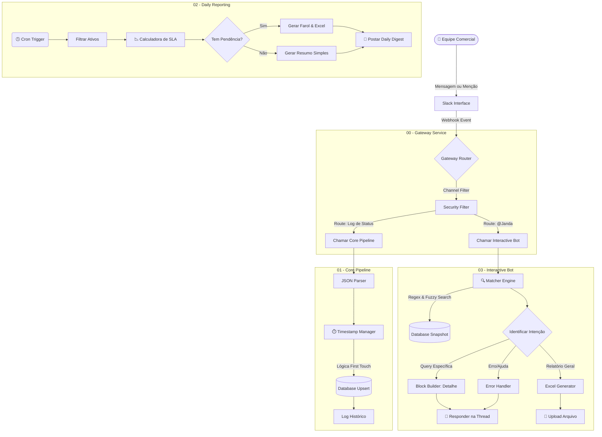

# Janda: Commercial Operations Orchestrator & SLA Engine

> **Nota:** Este repositório contém a lógica arquitetural, os fluxos de orquestração e snippets de código do projeto "Janda". Credenciais corporativas, Webhooks e dados sensíveis (PII) foram ofuscados.

---

## Sobre o Projeto

A **Janda** é uma agente de **ChatOps Determinístico** desenvolvida para orquestrar o fluxo de informações do departamento comercial de um Shopping Center de grande porte (+90k m² ABL).

Diferente de assistentes baseados em IA Generativa, a Janda atua como uma **Máquina de Estados (State Machine)** rígida. Ela monitora o ciclo de vida de contratos, obras, acesso a sistema interno e documentação de locatários, garantindo auditoria de datas, cálculo preciso de SLAs e recuperação instantânea de dados via _Slack_.

O sistema atua como *Middleware*, conectando a entrada de dados não estruturada (preenchimento de lista no _Slack_ - plataforma corporativa de comunicação) a um banco de dados estruturado, transformando o _Slack_ em uma interface de comando (CLI) para a equipe de negócios.

---

## Contexto e Impacto Real (Production Environment)

A solução foi implantada para unificar o fluxo de dados entre as equipes de Vendas (Campo) e Operacional (Back-office). Antes da Janda, o acompanhamento era realizado de forma fragmentada; a automação centralizou essas informações, estabelecendo uma camada de visibilidade compartilhada e padronização no ciclo de vida das operações.

**Key Performance Indicators (KPIs):**
* **Padronização & Rotina:** Mensagens padronizadas e implementação de horários para enviar os updates e relatórios, diminuindo a média de notificações anterior de ~3 para 1 por dia;
* **Redução de Latência:** Otimização de **1.260 horas anuais** da equipe comercial (Foco Estratégico), considerando estudos que indicam que o cérebro humano leva em torno de 25 min. pra recuperar a concentração após uma interrupção (Context Switching);
* **Auditoria de SLA:** Implementação de rastreabilidade de prazos baseada em eventos (ex: abertura de protocolo de confecção de contrato), permitindo identificar gargalos no funil de locação;
* **User Experience:** Adoção imediata pela equipe devido à interface via _Slack_ (Zero-Learning Curve), eliminando a necessidade de treinamento em novos ERPs.

---

## Arquitetura Técnica

O sistema utiliza uma arquitetura de **Microsserviços via Workflows**, onde cada fluxo no _n8n_ tem uma responsabilidade única e isolada (Single Responsibility Principle).

### Diagrama de Fluxo

---

## Deep Dive: Lógica de Negócio

**1. Timestamp Immutability (First Touch Logic)**

Para garantir a integridade dos SLAs, o sistema ignora eventos duplicados e sela a data do "Primeiro Toque". Isso impede que reedições de mensagens no _Slack_ alterem o histórico de auditoria, garantindo um log de eventos append-only.

**2. Hybrid Matcher Engine**

Para lidar com erros de digitação humanos, o bot utiliza um motor de busca híbrido que combina:

* **Busca Estruturada:** Identifica padrões Tipo - Marca (ex: "Loja - Adidas");
* **Busca Global:** Varre todo o snapshot por palavras-chave normalizadas (sem acentos/case-insensitive);
* **Sanitização:** Remove caracteres especiais e stop-words para evitar falso-negativos.

**3. Threaded Reporting UX**

Para evitar poluição visual no canal (Flood), todos os relatórios complexos (Farol de Pendências) utilizam o recurso de responder em Threads do _Slack_.

* **Mensagem Pai:** Cabeçalho com Data e Contexto;
* **Thread 1:** Resumo de novas operações adicionadas na lista do _Slack_ e contatos assinados no dia anterior;
* **Thread 2:** Farol de Pendências (apenas se houver atrasos);
* **Thread 3:** Arquivo Excel detalhado do Farol de Pendências.

---

## Stack Tecnológico

**Orquestração:** _n8n_

**Linguagem de Script:** JavaScript para manipulação de dados complexos.

**Interface:** _Slack_ & Block Kit Framework.

**Banco de Dados:** _datatables_ nativos do _n8n_.

**Tratamento de Dados:** 

> * **RegEx & String Normalization:** Para o motor de busca híbrido e limpeza de inputs do Slack;
> * **JSON Object Parsing:** Tratamento de payloads complexos e estruturas de blocos da API do Slack;
> * **Advanced Date Logic:** Algoritmos para cálculo de SLA em dias corridos, manipulação de Timezones (UTC para PT-BR) e validação de cronogramas.

---

## Data Persistence & Portability

A escolha dos _n8n Data Tables_ como repositório inicial foi estratégica, priorizando a baixa latência de escrita e a agilidade no ciclo de desenvolvimento (MVP).

* **Interoperabilidade:** O sistema foi desenhado para ser independente do banco de dados. A transição para um banco relacional ou ferramentas de NoCode exige apenas a troca de nodes nos workflows, sem necessidade de refatoração da lógica de negócio.

* **Data Export:** Para análises imediatas e modelagem de dados, o _n8n_ permite a extração dos _datatables_ em formato CSV. Além disso, a prórpia Janda envia, quando requisitada, um relatório geral em XLSX da _Snapshot_ atual com as operações em acompanhamento. Isso garante portabilidade total para conversão em XLSX ou ingestão direta em ferramentas de BI, assegurando que o histórico da operação nunca fique retido em uma estrutura proprietária.

---

## Roadmap de Evolução Estratégica

**Fase 1:** Consolidação e Feedback (Curto Prazo)
Foco na homologação total (Comercial SCIB/Comercial Corporativo/TD) dos fluxos de notificações e aculturamento do time comercial SCIB. O objetivo é garantir que os resumos em horários pré-definidos sejam a fonte de consulta para a gestão e um guia de prioridades diárias do time.

Fase 2: Escalabilidade (Médio-Longo Prazo)
Integração direta dos dados estruturados do n8n com ferramentas de Business Intelligence (BI) para dashboards executivos.

---

## Conclusão

O Projeto Janda vai além de uma automação isolada; se trata da transição do Comercial para uma gestão orientada por dados (Data-Driven). A tecnologia assume o papel operacional rígido para que a equipe foque no que é insubstituível: a estratégia, a negociação e o relacionamento.
